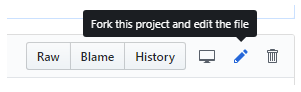
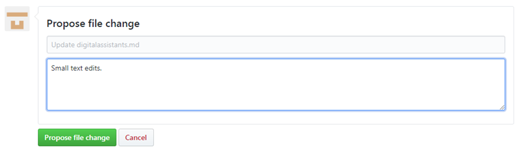
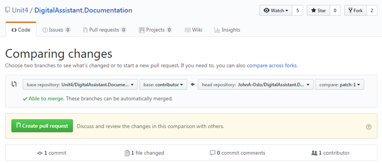

# Making contributions to the Unit4 People Platform documentation

Thanks for wishing to contribute to the Unit4 People Platform documentation and this guide covers what you need to know. To make contributions you must have a GitHub account which is free and easy to create.

The Unit4 People Platform documentation is hosted on GitHub and is open source with public-facing repositories. This allows ourusers of our products to contribute directly to our documentation and communicate with our developer teams via pull requests.

The documentation is written using Markdown which is an easy-to-read, easy-to-write syntax for formatting plain text. If you're new to Markdown then see [this guide](https://help.github.com/en/articles/basic-writing-and-formatting-syntax) for more details.

Each topic on the Unit4 People Platform documentation website includes an **Edit this topic** button to allow you to suggest changes. When you click this button, the corresponding source file is opened in GitHub for you to edit.

#### Making quick edits
To make quick edits where you want to do something such as fix a type or correct a sentence etc. you can just use the GitHub portal as follows:

1. When the topic is open, click the pencil icon to edit the topic as shown below.

    > 

2. Make your changes in the web editor. Click the _**Preview changes**_ tab if you want to check the formatting of your change.

3. Once you're happy with your changes, scroll to the bottom of the page, enter a title and description for your changes and click **Propose file change**.
    >

4. Now that you've proposed your change, you need to create a pull request to ask the owners of the repository to "pull" your changes into their repository. If you're new to GitHub, see [About Pull Requests](https://help.github.com/en/articles/about-pull-requests) for more information. When you clicked on **Propose file change**, you should have been taken to a new page that looks like this:

    >

5. Click **Create pull request**, enter a title and a meanigful description for the pull request, and then click **Create pull request** again. 

**Once you've submitted your pull request**

Once you've submitted your pull request a Unit4 team member will review and merge your PR if it looks good, or you might get some feedback with requests for other changes or proposals for alternative changes etc..

The GitHub editing UI responds to your permissions on the repository. The preceding images are accurate for contributors that do not have write permissions to the target repository. GitHub automatically creates a fork of the target repository in your account. If you have write-access to the target repository, GitHub creates a new branch in the target repo. The branch name has the form <GitHubId>-patch-n using your GitHub ID, and a numeric identifier for the patch branch.
